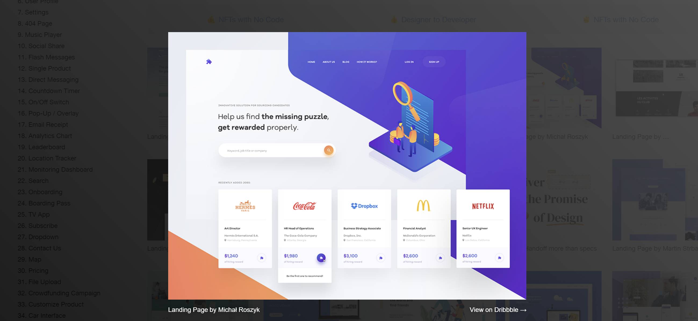
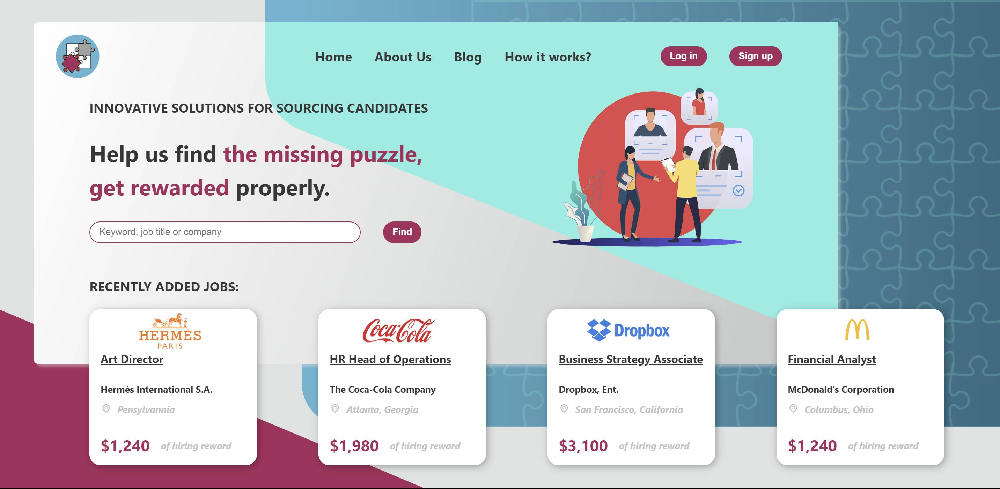

# Missing Puzzle
Missing Puzzle is a landing page created as a personal project after completing the Nuclio Digital School Bootcamp of the June 2023 cohort. 

## Table of Contents

1. Project Description
2. Platform Walkthrough
3. Technologies Used
4. Configuration
5. Project Lead
   
# Project Description
Missing Puzzle is a landing page based on the one extracted from the website https://collectui.com/designers/michalroszyk/landing-page, where I've incorporated my personal style into some elements while maintaining the main structure of the original one.
The frontend is entirely built using React and CSS.
This project aims to solidify the concepts studied and applied during the completed master's program.
 

# Platform Walkthrough

### Landing Page
This web application is a single-page design intended for PC screens. The page features a cooperative color palette used consistently across various elements to emphasize important words and links, which change color on hover.

At the top of the page, a navigation bar is provided for user-friendly access to other pages. 

In the middle of the page, the purpose is explained, accompanied by an appealing image to capture the audience's attention. 

At the bottom of the page, a grid of cards showcases various available job opportunities.

In the screenshots below, you can view the original landing page, which served as inspiration for mine.






# Technologies Used
### Main Front-End Libraries:

* React

# Configuration

* Clone this repository to your local machine:
````
$ git clone https://github.com/Ananke85/Missing-Puzzle
````
* Install project dependencies:
```
$ npm install
````
* Open a terminal and start the client:
```
$ npm run dev
````
* Open a web browser and go to the following port to view the application:
```
http://localhost:5173/
````

# Project Lead
Lorena Carmona
